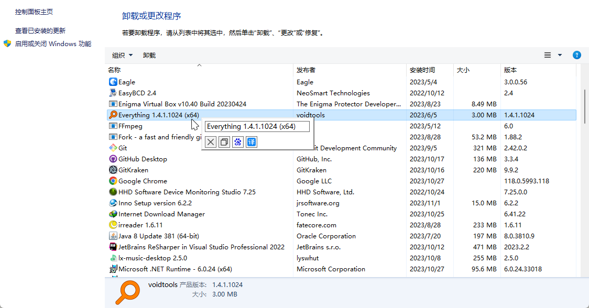

# Textify

### 一、简介
将电脑屏幕上不可复制的文本识别出来。且用户可以自定义快捷按钮，如：一键打开浏览器并搜索文本框内的文字，或一键翻译文字。 

### 二、预览

### 三、功能
1. 自定义快捷键，默认是 shift + 鼠标右键
2. Esc 键关闭捕获窗口
3. 自定义下方按钮，可以增删改按钮 [文档](https://github.com/Hunlongyu/Textify/wiki/%E8%87%AA%E5%AE%9A%E4%B9%89%E6%8C%89%E9%92%AE)
4. 软件体积小 200KB 左右
5. 离线使用，不获取用户信息
6. 排除程序，即指定程序不触发快捷键

### 四、注意事项
1. 软件并非能百分百概率获取到文字。
2. 必须是文字，比如按钮上的文字，而不是图片上的文字。
3. 如果某些应用捕获窗口没有弹出来，请在设置里开启管理员权限启动。或右键属性开启管理员权限。

### 五、最后
程序灵感来源于同名开源软件：https://github.com/m417z/Textify

感谢！
